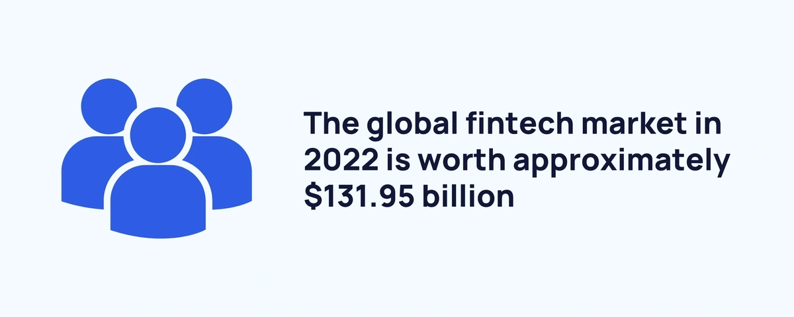
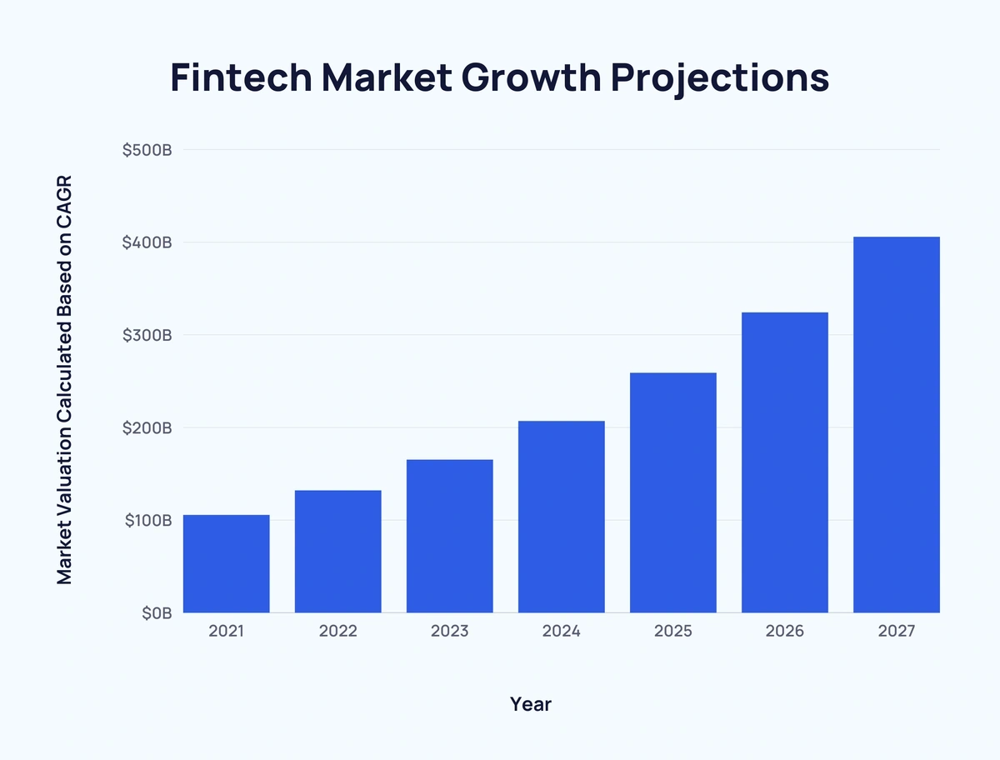
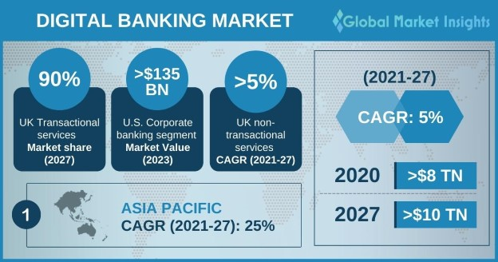

# Market Size

> TODO: (sacha)  find nr's and pictures how big this market is for the different topics

Digital transformation used to be something that’s just good to have. But since COVID-19 disrupted business operations worldwide, many organizations now see digital transformation as a necessary step in preserving their business as reflected by the most current digital transformation statistics. Fueled by speedy internet everywhere, digitization now plays a critical role in adding business value.

The global Fintech industry is growing at an exponential rate: 
- The global fintech market is estimated to be worth $131.95 billion
- The fintech space is set to surpass $400 billion by 2027
- The fintech market is growing at a CAGR of 25.18%
- Over 26,000 fintech startups were launched last year
- In total, an estimated $8.49 trillion of digital payments will be made in 2022
- The global digital banking market size was valued at $8 trillion in 2020 and is growing at a CAGR of 5% from 2021 to 2027

By 2026, this fintech industry is projected to grow to $324 billion at a compound annual growth rate (CAGR) of 25.18%. 

There are several key factors behind the continued rapid growth within the fintech space. Advancing automation tech and an ever-growing array of online and app-based services are perhaps the most important factor driving fintech’s growth. Improved accessibility and reduced costs mean fintech solutions are more readily available to would-be consumers.

In addition, lenient regulations in the space and changing consumer demands/expectations have further boosted the market.

The E-Bank (Neo/Challenger Bank) market size was valued at USD 28.73 Billion in 2020 and is projected to reach USD 627.99 Billion by 2028, growing at a CAGR of 47.17% from 2021 to 2028.1  

An estimated $8.49 trillion of digital payments will be processed globally during the course of this year. Increasing at a CAGR of 12.31% until 2027.

### Some global statistics: 

- The global digital transformation market is projected to grow from $469.8 billion in 2020 to $1 trillion by 2025, at a compound annual growth rate (CAGR) of 16.5% during this period (Research&Markets, 2020).
- Digitally transformed organizations are projected to contribute to more than half of the global gross domestic product (GDP) by 2023, accounting for $53.3 trillion (IDC, 2020).
- 65% of the world’s GDP is predicted to be digitized by 2022 (IMF, 2020).
- 70% of organizations have a digital transformation strategy or are working on one (PTC, 2019).
- Industrial enterprises are seen to have benefited the most from digital transformations (PTC, 2019).
- 55% of startups have already adopted a digital business strategy (IDC, 2018).
- 38% of traditional businesses have adopted a digital business strategy (IDC, 2018).
- 89% of enterprises are planning to adopt or have already adopted a digital business strategy (IDC, 2018).
- Top digital business strategy adopters include services (95%), financial services (93%), and healthcare (92%) (IDC, 2018).
- 39% of executives expect to benefit from their digital transformation initiatives in 3 to 5 years (Fortinet, 2018).
- 21% of North American and European enterprises say their digital transformation is done (Forrester, 2018).