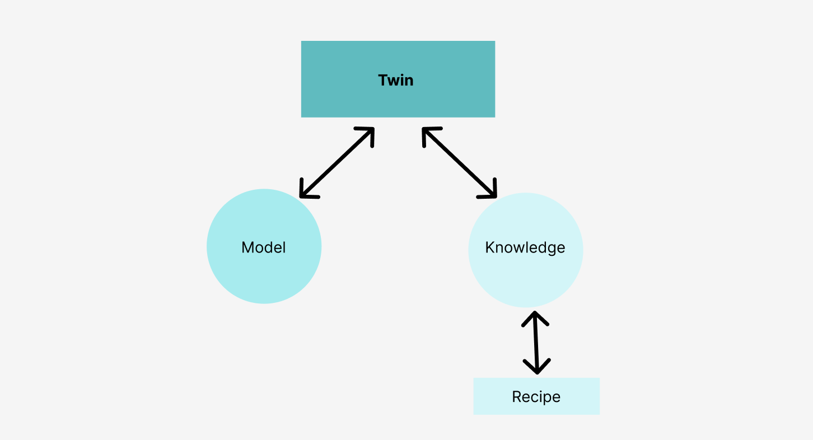

# New Onion Layers

  

What does IT have to do with onions...

Just like onions, our current applications have many layers. There is the initial model, the core of the onion. That core, however, is patched by layers and layers of painkiller fixes. The more layers, the greater the complexity of the application.

## Model-First Paradigm

A model-first application has a pre-defined internal structure, with specific functions and data tables intertwined. On top of this core, there are many layers, such as the API layer for communicating with other applications, and the UI layer for interfacing with the user. In order to change the core, every surrounding layer must also be modified. Therefore, when there is a problem or a bug, or when changes are required, it is standard to layer a painkiller fix or patch on top. In this way, layers keep being added on top of the base which adds complexity, and the problem is never truly fixed at the root. 

Imagine there are hundreds of such onions. The core models of every application are fundamentally different; they have been defined in different ways. Yet, there is also substantial overlap; a CRM application and an invoicing application might contain the same information about clients, but stored in contrasting ways.

All these onions now need to communicate with each other. However, their messages must pass through their various onion layers and even then, every application needs to know exactly how to process a message from every other application.  The result is a system that is incredibly complex and fragmented.

The problem here is that indvidual systems are trying to redo things better, howver they are using the same base infrastructure. They simply redefine that base towards a relevant issue. As such, we simply cannot attain an optimal systems, because there is no consistency between applications, they are single mindedly focused on their specific function. If multiple people or applications need to use that function it gets very complicated. 

One way to go around this has been to use an enterprise service bus (ESB). An ESB controls how models talk to each other by pre-defining the messages exchanged. While this does fix some issues, we are still left with onions, we have not solved the problem at its root.

## Digital Twin Solution

The digital twin solution employs an actor-first structure instead of a model-first one. At the core of this structure is a digital entity that acts on our behalf. It has access to the model; the essential set of data relevant to and describing that user. 

Distinct, is the functional knowledge (how to do things) that a digital twin has access to. This knowledge is the set of functions or recipes that a twin can perform. Through the use of Domain Specific Language, it becomes incredibly ease to adapt and reuse recipes.

With this structure, if an error needs to be fixed or an upgrade needs to be applied, it is very easy to add fields to the data model and to modify the recipes. This is because there is a clear separation of the two and a standard procedure through which the twin manages everything. Moreover, there is very little duplication of information across the internet, because the twin is the single source of truth for its data.

> TODO: (kristof) check if this is ok