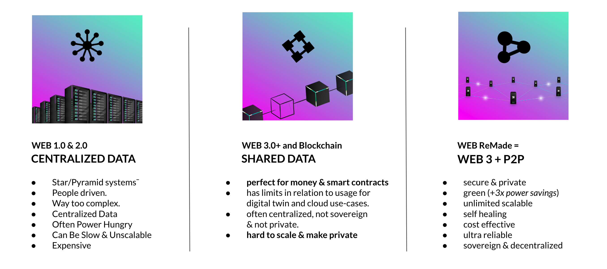

# Project Intro

> Digital Twin primitive: composable self-contained for sovereign digital life

## Introduction and references

How we use the internet today is not in our best interest: we don’t own our data, most of the physical infrastructure is centralized, and a few companies own most of the internet. A significant redesign is in order to fit the needs of the modern world. Let us introduce the concept of a **_digital twin_**, our decentralized digital counterpart, to build experiences on the internet, a planet and human-centric. 

_The Digital Twin is a primitive that assures you only own your data and no one else. Each digital twin is an actor that can talk to each other. Twins are a fully independent entity that knows how to translate that specific domain language to a functionality. Experience goes from the high-level requirements of the language down to the message to the twin.(RC: change to a much more technological definition.)_

## Intro web4

  

_It consists of a peer-to-peer infrastructure. A decentralized cloud system to support a set of tool that will be used in the digital twin. The optimization is huge (x10) in terms of sustainability compared to centralized cloud computing. It is also more cost-effective._

## Intro FreeFlow

As an organization, FreeFlow aims to be a socioeconomic network where people collaborate to accelerate social platform regeneration and generate positive externalities.

## Problem

In the next ten years, we will witness technological macro trends converge. The AI machines race, the rise of micro-economies, and the intertwined-metaverse reality will assemble and merge into the next-gen user experiences. And the Digital Twin (DT), a simple yet powerful agnostic standard, can offer, at the same time, autonomy and privacy for individuals and surveillance control to dominant companies in the information technology industry. Undoubtedly DT primitives will impact work and society as the interface to the digital world in a conscious machine era.

Anyway, it's a kind of moonshot now. However, organizations out there are developing different Digital Twin concepts. The basic idea from which it scaffolds off is a virtual representation that serves as the real-time digital counterpart of an individual, object, or process. 

The industry is talented in creating solutions to problems that should have never been there in the first place. 

We call this the Onion Problem. Still, it means that systems get so complicated that people don’t dare to change anything inside, so everyone keeps on creating other layers on top of the layers which already exist, this lead to even more complicated systems which no one seems to fully understand and allowing hackers to have a great time because there are hundreds of places to find vulnerabilities. The current way the internet is created is just wrong; the client-server is simply wrong, the fact that we duplicate our files at least ten times on the internet is wrong, and we need Web 4.0. 

## Solution

Our purpose here is to find resources to build a composable, open-source Digital Twin, based on ThreeFold's Web4 proposal, running on top of the decentralized ThreeFold's grid, though layer 0 agnostic.

Decentralized grid infrastructure and network architectures combined are 100% independent of any server or blockchain-based Internet experience and can give individuals control over their data. A sovereign center of digital life from work to social.

FreeFlow is teaming up with ThreeFold to lead the architecture and building of the Digital Twin. FreeFlow is a ThreeFold partner, a self-government community ​​that is experimenting at the edges of the art, positive-sum games, and protocol economy. As we like to say: "We're all gonna make… the machines work for people, not companies".

## Wrapping up 

* A trust-based system, where people can be themselves and communicate with each other and the project in a safe container with entire identity and transparency. 
* An application and development platform allows them to build their “experience” in the fastest possible way with less complexity and no need to re-invent everything (like is the case now). 
* Storage system where all data & information are stored by the user and owned by the user. An ultra-reliable system that can never lose data and scales to a planetary scale. 

