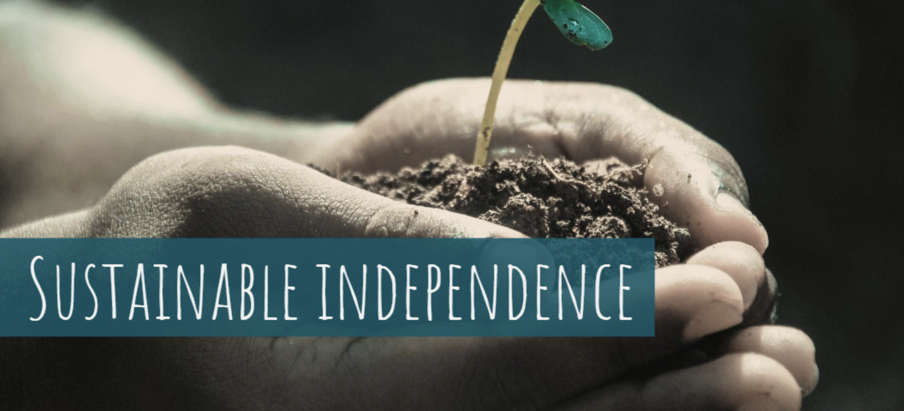

# Independance and Sustainability Policies (ISP)

  

Mama Samia Institute researches and develops required Independance and Sustainability Policies (ISP’s) for the multiple projects as are required by the government of TNZ and ZNZ. 

### Independance and Sustainability Policies are based around following principles:

1. As much as possible, Tanzania company's (with majority shareholding from Tanzania investors) and/or Mama Samia Institute get unlimited access to all required Intellectual Property (e.g. source code in case of digital technology, or documents in case of other technology). Vendors who are not willing to open up their knowledge cannot deliver their projects to our country.

2. Break down each project to only having to use components which can be sourced from within the country or outside but then from multiple sources (India, China, Europe, US) directly from the manufacturer of the components. This resolves longevity and independence for the future.

3. Together with the partner (if needed) create local knowledge centers where the solutions can be recreated from the components as mentioned above without help from outside. The funding for such a local center needs to come from the project financing and the business case.

4. Create a large enough stock of replacement components as part of each project to make sure that continuation can be continued if the global supply chain has hiccups.

5. Ask for the most simple solutions which are just good enough for the requirements which are respectful for country resources and its people. Often things can be done in a much more simple way as vendors would like us to believe.

6. All products or services delivered need to be operated from TNZ/ZNZ.

7. No data can leave the country, all applications need to be hosted inside TNZ/ZNZ.

8. No product can have backdoors allowing others access into systems as deployed in the country.
In case backdoors cannot be removed, sufficient protection mechanisms need to be created to try and mitigate the issues. 

9. Do not sell out natural resources of TNZ and ZNZ, it's too easy right now for companies and people from outside to leverage the natural resources and divert the profits made from it outside the country. Resources from TNZ and ZNZ belong to people living in TNZ and ZNZ, as such these resources need to be protected and valued in the right way.

### Some examples of where we know it can be done

* Telecom infrastructure (4G/5G), eventually even with local manufacturing.
* Internet Infrastructure and most of its components.
* Electric vehicles (batteries, simple cars and bicycles, …).
* Education systems and its required knowledge base.
* Regenerative farming practices (organic fertilizers, data driven farming cycles, required machinery…) and its tools.

### How can this be done? 

We build amazing locations in TNZ/ZNZ where top talent = high quality engineers, coders and technologists and their families want to reside. This top talent gets free housing, 100% tax exemption for the time they work to deliver on the promise of ISP and most importantly a margin share in the success of the ISP project(s).

The Mama Samia Institute can be used as a validating point for the implementation of this approach, our aim is to also facilitate startups which can practically work on delivering some of the solutions 100% from within the country.

### Reality check

This ambitious goal will not be achieved in 1 year, it will require time to materialize and a shift in mentality where many in the country believe we have to rely on resources from outside and we don’t have enough belief in our own capabilities and value in relation to a global world.
