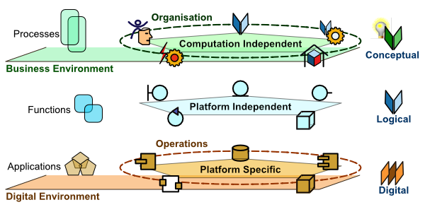

# Community Digital Backbone

This is a very important element of the full concept, it allows a community to self organize using digital technologies like digital twin as well as blockchain.

OurTown has access to technology as developed by ThreeFold to make this happen.

## Functions

- Multiple Local Digital Currencies for OurTown on a blockchain called the Community Digital Backbone (CDB).
    - One of them is a digital TSH, but only useable for now in OurTown
- Integrated Revenue Collection for ZNZ (TAX)
- Each commercial transaction in OurTown is registered on the CDB
    - This gives full insight in money spent and transfered between parties
    - Each commercial service/product delivered is tracked on the CDB
    - This allows allows automatic revenue collection e.g. for VAT but can be for other elements as well
- Implement a digital authentication system usable for all digital use cases, following standards as set by international organizations like world bank, african union, … Only one single sign on system.
- Implement a new digital backbone (internet system) to support all above with best sovereignty and security.
- Links with the OurTwin system

## More Advanced Functions

- Implement OurTown education system where every citizen can participate as teacher and/or student, serves as example for country and/or world.
- Implement a digital health system which can unlock primary health care to everyone at a much lower cost using means available by the citizens already (knowledge, herbs, best practices, generic medicine, …)
- Implement a OurTown governance system which is also an antidote against the cyber pandemic.

## The Concept

  

There is one system which is organized in layers to make it super easy to change for future requirements.

We implement it like this because our system needs to be the alternative to the [painkiller](../brave_new_world/no_pain_killer.md) approach.

There are 3 layers, each layer allows for easy abstraction, this backbone can be used for all required functions.

  