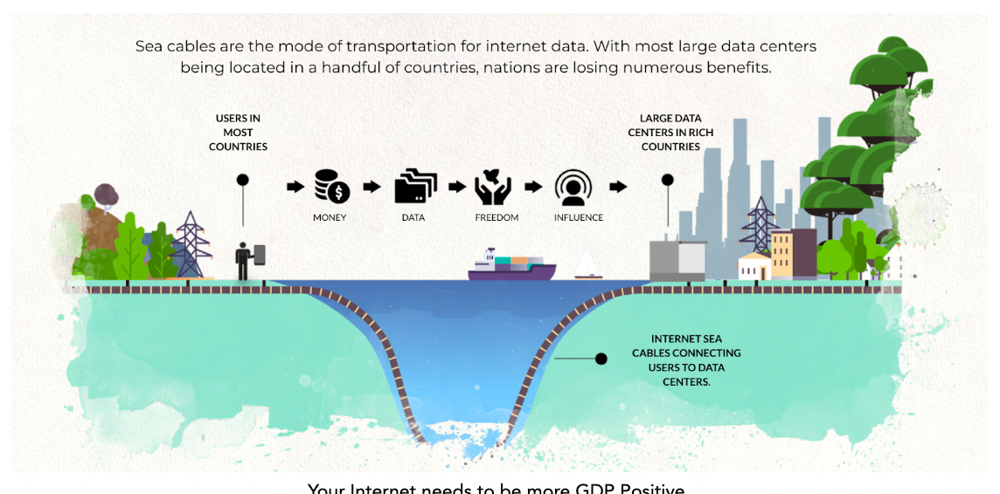

# ThreeFold
> TODO: (na) Fill out this section

  

ThreeFold is a decentralized, sovereign and sustainable internet infrastructure platform with +US$ 50m invested and about 100 people working full time on the project. ThreeFold is driven by their mission to empower 1 billion people with sustainable access to a self-sovereign Internet by 2030. 

ThreeFold solves two serious problems present in the legacy stack:

1. **Cost of expanding Internet infrastructure:** Large-scale, centralized data centers cost billions to build. The Internet needs to triple its infrastructure size this decade to support emerging data requirements. With an upcoming global economic downturn, an alternative is needed urgently. Threefold flips the current model upside down, incentivizes anyone with electricity and network to connect computers from their home or office to expand the Internet and earn monthly revenue.

2. **Loss of digital sovereignty and net-neutrality:** 20 companies own the Internet’s infrastructure today. This threatens our sovereignty and net neutrality and is a major concern for countries worldwide that have already started to cut the Internet into pieces e.g. great firewall of China. ThreeFold’s secure serverless infrastructure provides a peer-to-peer Internet model that solves most of the sovereignty and security concerns present in today’s infrastructure stack.

## ThreeFold benefits to OurWorld ZNZ

- All data remains within the country
- All users have a unique strongly authenticated identity (using novel mechanisms like proof of authenticity by means of peer review, which is much stronger compared to classic KYC/AML). This identity needs to be unique on a country scale and usable for all digital services of the government as well as private sector if they would like to
- All critical data (billing, identity, records, etc) are stored on a quantum safe storage system which means
- Data can never be lost
- Data can never be corrupted
- The storage system used needs to self heal in case of disaster or corruption
- All history stays intact, data cannot be modified
- Encryption technology is NOT enough for security, because it is not quantum safe
- The system needs to be ultra scalable, support tens of millions of users and needs to be able to scale to at least 1000 petabyte to be ready for the future
- Reliability policy needs to be configurable, so the data provider/user can decide the level of protection (redundancy) required
- Even if the main datacenters go down, the data should stay intact, uncorrupted and online.