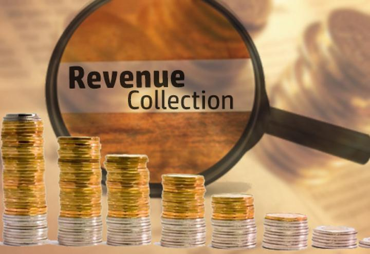

# TAX Revenue Collection

  

Today revenue collection is a very difficult job because there are lots of systems and different parties involved.

Imagine a system where every commercial transaction gets integrated without loosing flexibility and ease of use. This system would make tax collection an automatic integrated capability.

It is possible because the following systems would be integrated and make this possible

- [Digital Twin](/web4/architecture_highlevel/web4_digital_twin.md) = personal digital e-commerce interaction in all safety
- [OurLedger](/ourbackbone/ourledger/ourledger.md) = the blockchain making it all possible
- [Digital Payment Systems](psp.md) = the front end to the system
- [OurVerse = a digital web and metaverse system](/ourverse/ourverse.md) = ability for people to find what they want to buy or to publish what they want to sell
- [Government Dashboard](government_dashboard.md): visibility for government of TSIP Internal
- [Optional: CDBC](usecase_cbdc.md) = central bank digital currency 

This innovative way of working makes automated tax collection a much easier thing to do.

## Integration In Others Systems

### Telco

Mechanism that prevents Telco's to service customers unless there is an app installed on the phone which will do the following

- unified authentication mechanism
- payment interface
- measurement of network performance to multiple destinations
    - throughput
    - latency
- measurement of bandwidth used per user
- record the SIM, so we know exactly how many users

The resulting information is available in the [Government Dashboard](government_dashboard.md).

**All payments for the telco have to be done using the generic available payment systems to allow auditing and recording, all of this is under supervision of the central bank.**

### Ports

Digitalisation holds great potential for making maritime transport chains more efficient, flexible and agile. It thus opens up the possibility for ports to meet the challenges of globalisation, demographic change and urbanisation.

- Improved efficiency operations of the port and its specific transport chains
- Simplification and automation of complex processes
- Reduction of energy consumption
- Internetational digital networking between seaports for improved security and opportunities within maritime transport chain.
- By storing data locally, ports can develop and use new business models through the targeted exchange of information and data.
- Augmented/ Virtual reality can be used to support inport and seaport activies.

> TODO: (kristof)

