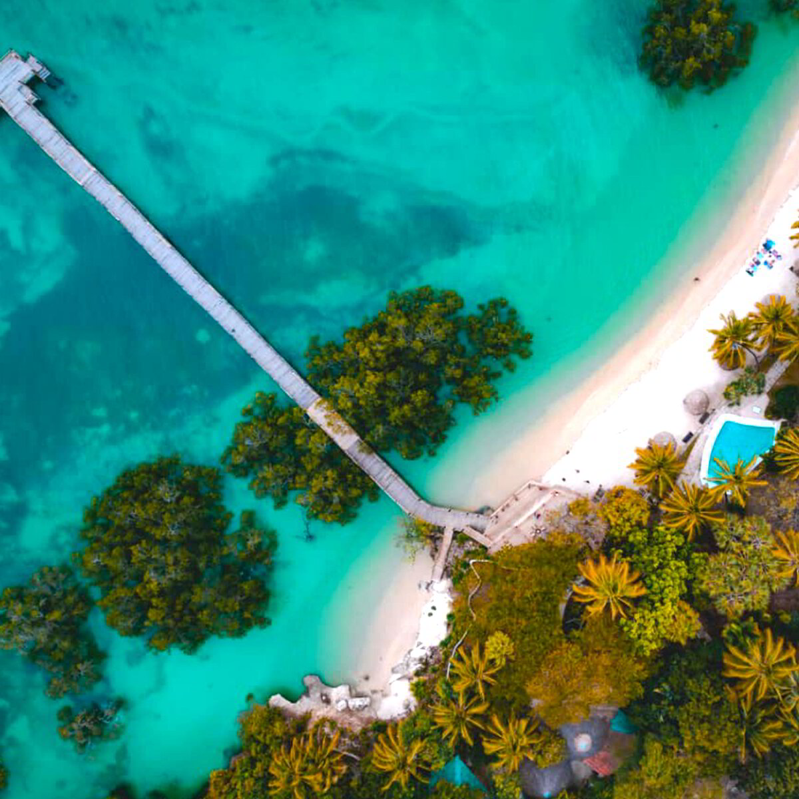
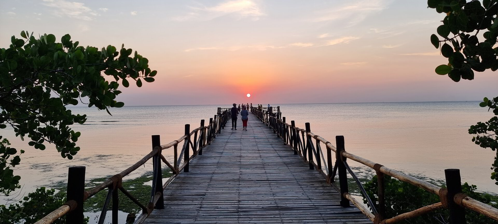
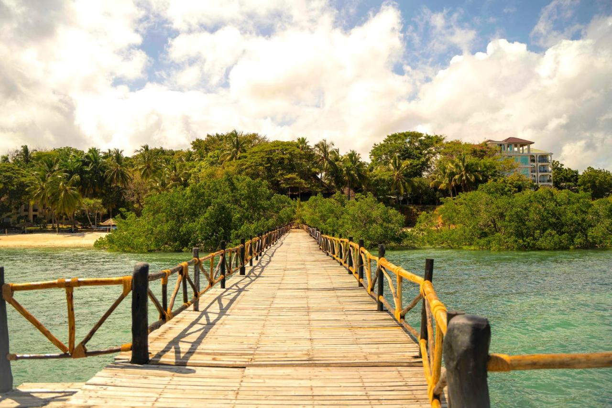
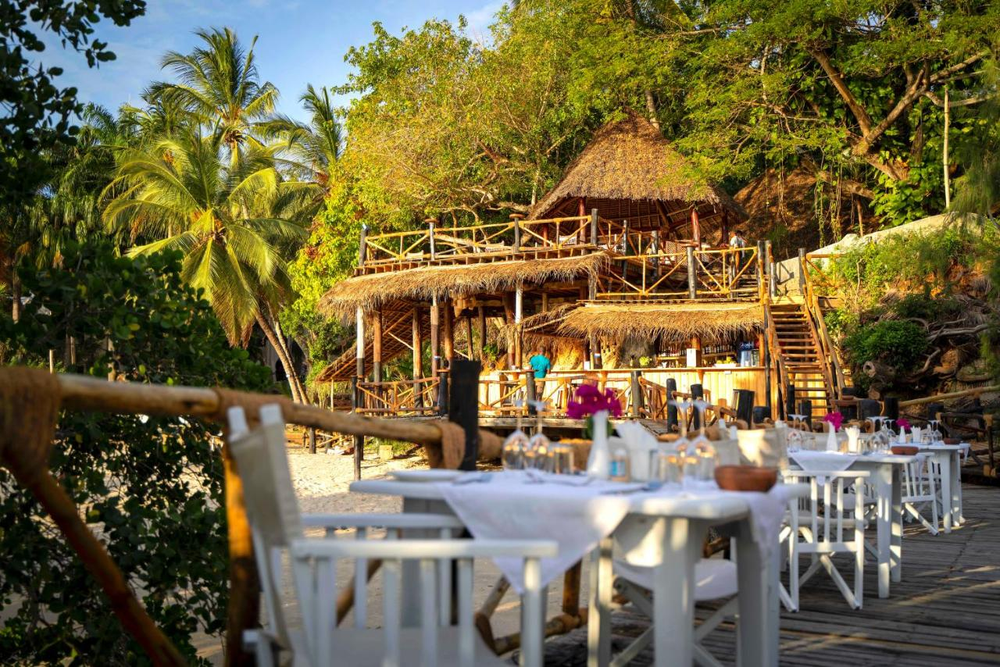
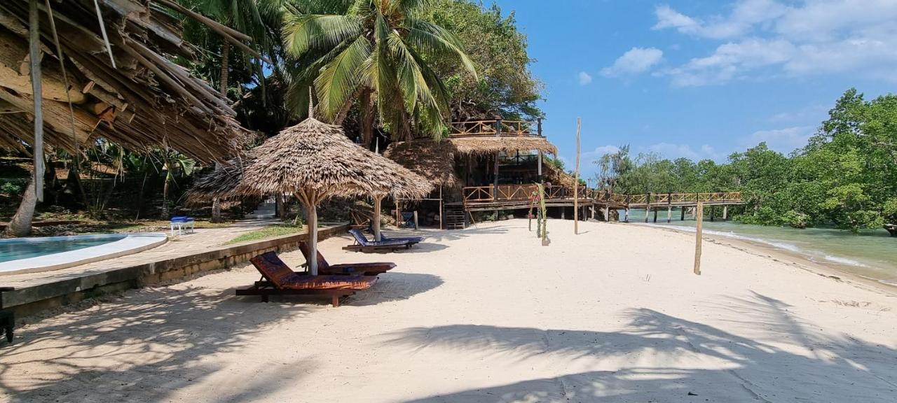
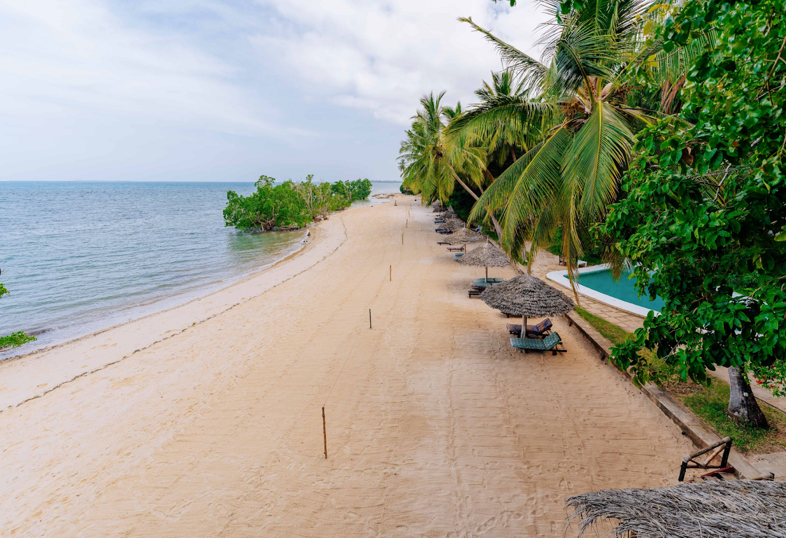
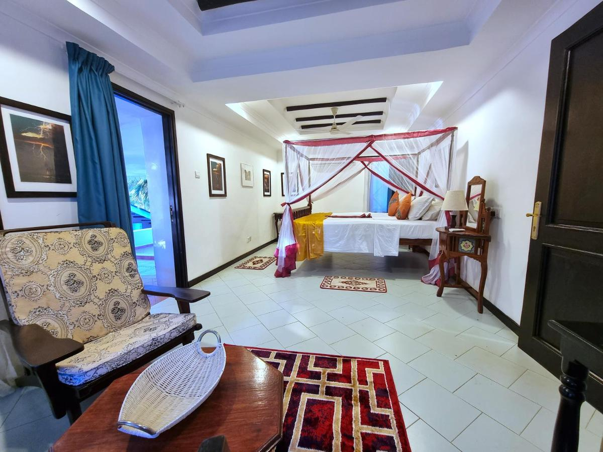
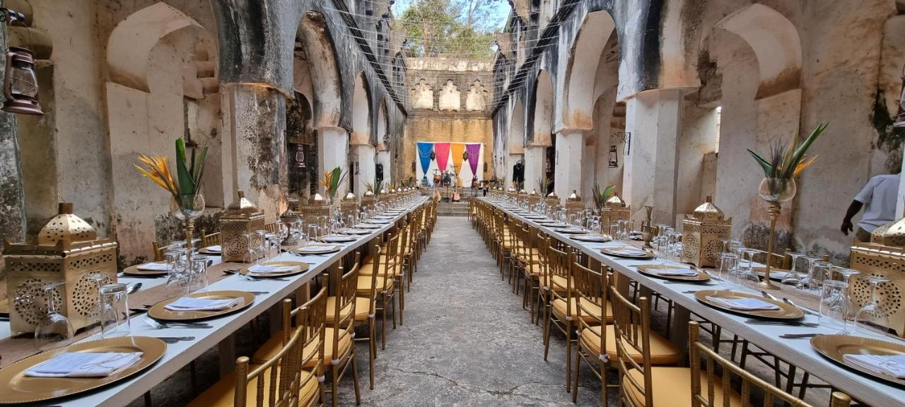
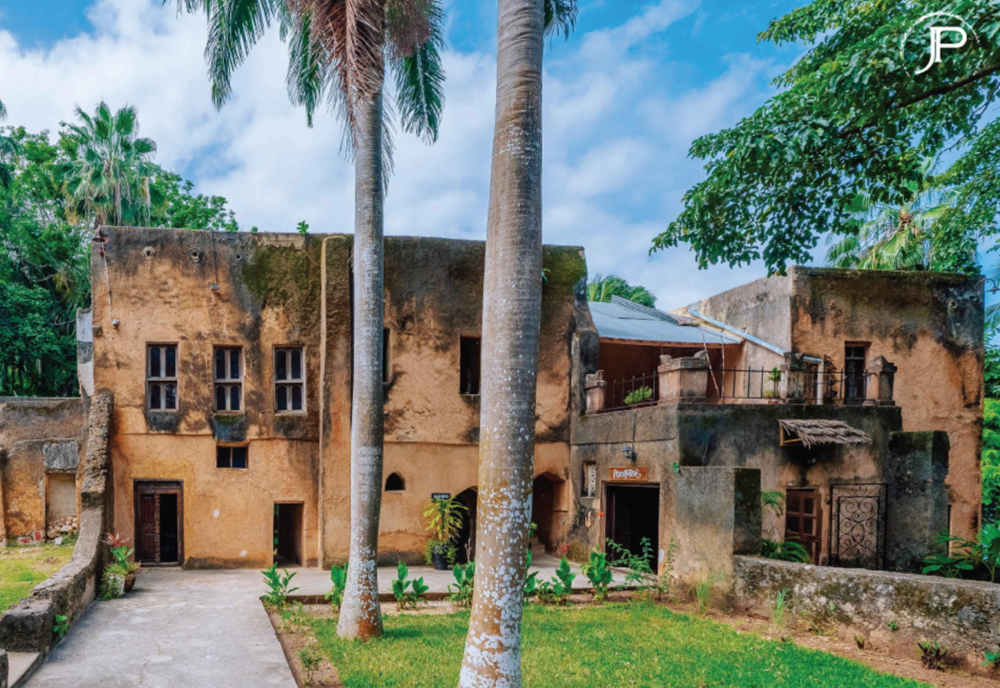
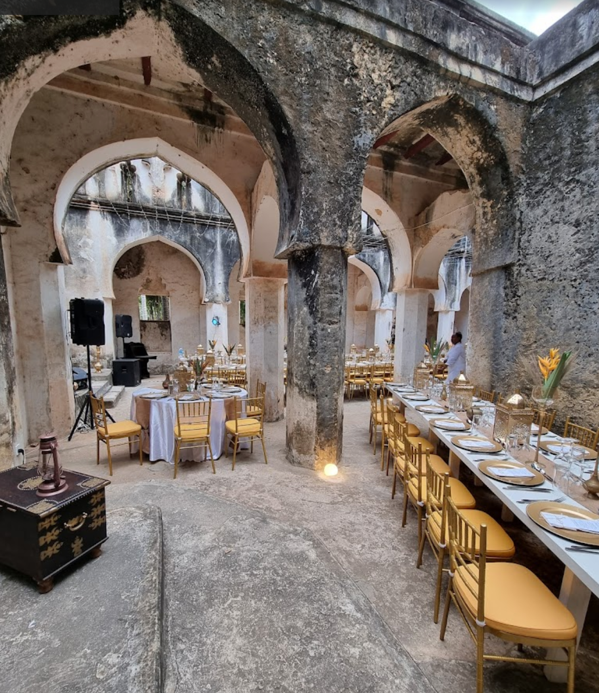

# Zanzibar West - JP

Jungle Paradise is based at Mbweni in Zanzibar and is home to a super nice boutique hotel, botanical gardens and ruins with a rich history.

The location was instrumental in abolishing slavery and had a school where mainly slave children had a chance to get educated and become free.

Mbweni was a Universities Mission to Central Africa (UMCA) base and settlement for former slaves in the 19th century. The ruins of St Mary’s School for Girls, built by missionaries for girls freed from slave ships, is now set amid the lush gardens of Mbweni Ruins.

The Historic Ruins of the Mbweni School for freed slaves was founded in 1874, with associations with Sir John Kirk, Zanzibar’s first scientific botanist. 

## Location 

Jungle Paradise is located in Mbweni, Zanzibar. This location in the capital is ideal for digital nomads as they have quick access to Zanzibar's business district and airport, while being in a remote and peaceful neighbourhood.

- 5 mins to International School of Zanzibar
- 7 mins to Karume Institute of Science and Technology
- 11 mins to Abeid Amani Karume International Airport
- 15 mins to Stone Town
- 20 mins to Tawakal Hospital

  

Mbweni, 5km south of Zanzibar Town,

## Amenities

#### Existing Hotel

Jungle paradise features exclusive and cozy, air-conditioned beachfront suites with a very high service standard. Each of the 13 existing rooms are fully furnished with balconies facing the ocean, beach and pool area, with it all interleaved in the jungle of the botanical garden. 

#### Restaurant

Jungle Paradise's “Ocean Breeze” Restaurant offers some of the best food in Zanzibar, along with a view of the sunset in the evenings. Jungle Paradise provides evening entertainment, including live music, based on several themes and artists and with a variety of cocktails mixed at “JP’s Beach Bar”. Jungle Paradise has all the rest of the amenities you would expect at such a high quality hotel. 

#### Developments

We have plans to extend this wonderful location:
- Restoration of the Ruins to create our co-creation, education and healing center.
- Add more rooms, we are adding 10 rooms as we speak and aim to have a total of 46 rooms.
- Restore the Ruins chapel to be able to be used as a multifunctional area (co-creation zone, events, …)
- Restore the botanical garden.
- Create a healing center and other related facilites.

#### Mbweni Gardens

The ruins are surrounded by a beautiful botanic garden which supports over 600 different kinds of tree species. Many mature trees that were propagated from the original garden of Kirk, which is now the nearby residence of the former Zanzibar President Amani Abeid Karume.

It has a mature rainforest atmosphere, only found in a few other places in Zanzibar and Pemba. It has many areas of native plants, including the coral rag forest on the cliff and mangroves on the shoreline.
 
## Financials

> TODO:

## Aesthetics

